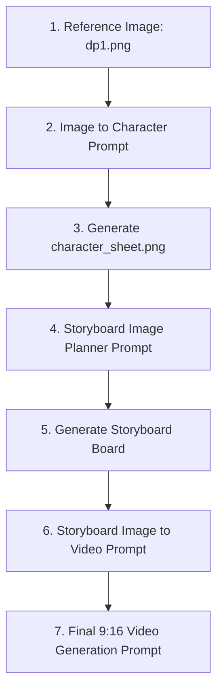

# AI Video Creation Prompts & Character Consistency Suite 🎬

This repository contains system prompt templates and reference assets to generate consistent virtual AI model/influencer images and video reels.

---

## 📂 Repository Contents

### 1. 🖼️ Reference Assets (Face-Lock Identity)
* **`dp1.png`**: The primary high-resolution profile reference image defining the AI model's face and look.
* **`character_sheet.png`**: A multi-angle visual reference sheet (front view, side profile, diagonal views) used by AI generators to lock facial details and maintain identity across frames.

### 2. 📝 AI System Prompts (Text Templates)
* **[ai_influencer_prompt.txt](file:///Users/akashyadav/Server/Go-Map/N8N-Agent/ai_video_creation/ai_influencer_prompt.txt)**: Instructions to generate consistent virtual influencer videos using reference images.
* **[image_to_character_prompt.txt](file:///Users/akashyadav/Server/Go-Map/N8N-Agent/ai_video_creation/image_to_character_prompt.txt)**: System prompt template for analyzing a single reference face and generating a multi-pose/multi-angle Character Sheet.
* **[storyboard_Image_planner_prompt.txt](file:///Users/akashyadav/Server/Go-Map/N8N-Agent/ai_video_creation/storyboard_Image_planner_prompt.txt)**: Prompt to map out song lyrics, dialogue, or video concepts into structured scene sequences (storyboard outlines).
* **[storyboard_Image_to_video_prompt.txt](file:///Users/akashyadav/Server/Go-Map/N8N-Agent/ai_video_creation/storyboard_Image_to_video_prompt.txt)**: A prompt designed to translate storyboard visual frames into final, detailed, and highly-specific video prompts (including Lip-sync, Physics Lock, and Camera Style sections).

---

## ⚡ Workflow Sequence

To create a consistent virtual influencer video from a concept, follow this sequence:

