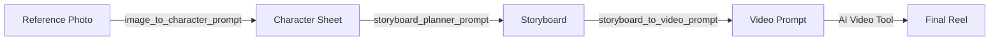

# AI Video Creation Pipeline

**One photo → Character Sheet → Storyboard → Cinematic Video Reel**

Works with Kling AI · Runway · Luma · Google Veo · Pika

---

## Pipeline Overview

---

## Case Study — Full Pipeline Output

### 1. Reference Image → `dp1.png`

Single source photo used as the identity anchor for the entire pipeline.

  

### 2. Character Sheet → `character_sheet.png`

Generated using [`image_to_character_prompt.txt`](image_to_character_prompt.txt) — locks face shape, eyes, skin tone, hair, expression, and accessories for identity consistency across all generations.

  

### 3. Storyboard → `storyboard_Image.png`

Generated using [`storyboard_Image_planner_prompt.txt`](storyboard_Image_planner_prompt.txt) — 6-panel cinematic layout with scene titles, camera styles, mood, and direction notes.

  

### 4. Final Output → `demo.gif`

Generated using [`storyboard_Image_to_video_prompt.txt`](storyboard_Image_to_video_prompt.txt) — production-ready 9:16 reel with lip-sync, physics lock, and cinematic camera work.

  

---

## How to Use

### Step 1 — Generate Character Sheet

Upload your reference photo to any AI image tool (Gemini, ChatGPT, Midjourney) with:

**Prompt →** [`image_to_character_prompt.txt`](image_to_character_prompt.txt)

The AI analyzes facial features and generates a structured character sheet with an identity lock and consistency priority strip.

### Step 2 — Plan Storyboard

Upload your character sheet + reel concept (song lyrics, product, or theme) with:

**Prompt →** [`storyboard_Image_planner_prompt.txt`](storyboard_Image_planner_prompt.txt)

Creates a 6-panel 3×2 storyboard with scene flow, camera styles, and direction notes. Asks for your approval before finalizing.

### Step 3 — Generate Video Prompt

Upload the storyboard image with:

**Prompt →** [`storyboard_Image_to_video_prompt.txt`](storyboard_Image_to_video_prompt.txt)

Outputs a detailed, timestamped video generation prompt with scene-by-scene breakdown, physics lock rules, lip-sync instructions, camera styles, and negative prompts.

### Step 4 — Generate Video

Paste the output prompt into your AI video tool along with `character_sheet.png` as reference.

| Tool | Best For |
|:-----|:---------|
| Kling AI | Lip-sync + identity consistency |
| Runway Gen-3 | Cinematic motion |
| Luma Dream Machine | Fast iterations |
| Google Veo | Photorealism |

---

## Bonus — Direct Video Prompt

For quick one-shot videos without the full pipeline:

**Prompt →** [`ai_influencer_prompt.txt`](ai_influencer_prompt.txt)

Swap the Hindi dialogue section for each new video. Everything else stays locked.

---

## Files

| File | Purpose |
|:-----|:--------|
| `dp1.png` | Source identity photo |
| `character_sheet.png` | Identity lock reference sheet |
| `storyboard_Image.png` | 6-panel cinematic storyboard |
| `demo.gif` | Final output preview |
| `Finally_Video.mp4` | Final output (full quality) |
| `image_to_character_prompt.txt` | Photo → Character Sheet |
| `storyboard_Image_planner_prompt.txt` | Sheet → Storyboard |
| `storyboard_Image_to_video_prompt.txt` | Storyboard → Video Prompt |
| `ai_influencer_prompt.txt` | Direct video generation |

---

**No code required. Fully prompt-driven.**

⭐ Star this repo if it saved you time.

