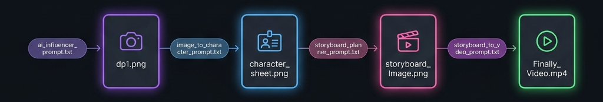
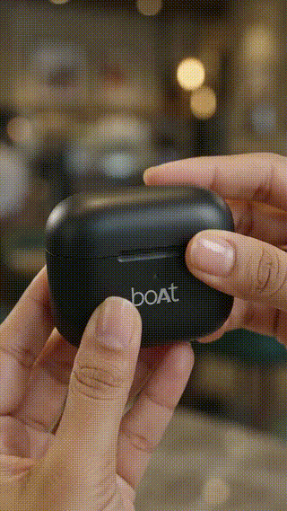

# AI Video Creation Pipeline 🎬

> **Turn a single prompt into a cinematic AI-generated Instagram reel — fully prompt-driven, no code required.**

[](#)
[](#)
[](https://github.com/kodelyx/ai-video-creation/stargazers)

---

## Pipeline Overview



| Step | Prompt Used | Output Generated |
|:----:|:------------|:-----------------|
| 1 | [`ai_influencer_prompt.txt`](prompts/ai_influencer_prompt.txt) | AI Character Photo (`dp1.png`) |
| 2 | [`image_to_character_prompt.txt`](prompts/image_to_character_prompt.txt) | Character Identity Sheet (`character_sheet.png`) |
| 3 | [`storyboard_Image_planner_prompt.txt`](prompts/storyboard_Image_planner_prompt.txt) | Cinematic Storyboard (`storyboard_Image.png`) |
| 4 | [`storyboard_Image_to_video_prompt.txt`](prompts/storyboard_Image_to_video_prompt.txt) | Final Video Reel (`Finally_Video.mp4`) |

---

## Live Demo — Actual Pipeline Output

### Step 1 → AI Character Photo (`dp1.png`)

This character image is generated using [`ai_influencer_prompt.txt`](prompts/ai_influencer_prompt.txt). The prompt defines the AI influencer's complete identity — face shape, eyes, skin tone, hair, expression, and style. This becomes the identity anchor for the entire pipeline.

> **Prompt:** [`ai_influencer_prompt.txt`](prompts/ai_influencer_prompt.txt)  
> **Output:** `dp1.png`


---

### Step 2 → Character Identity Sheet (`character_sheet.png`)

The AI character photo (`dp1.png`) is fed into [`image_to_character_prompt.txt`](prompts/image_to_character_prompt.txt). The AI analyzes every facial detail and generates a structured **Identity Lock Sheet** — cataloging face shape, eyes, nose, lips, skin tone, hair, expression, makeup, clothing, accessories, pose, lighting, and camera characteristics.

> **Input:** `dp1.png`  
> **Prompt:** [`image_to_character_prompt.txt`](prompts/image_to_character_prompt.txt)  
> **Output:** `character_sheet.png`


The bottom strip shows **Consistency Priority (High → Low):** Face Shape → Eyes → Eyebrows → Nose → Lips → Hairline → Hairstyle → Skin Tone → Accessories

---

### Step 3 → Cinematic Storyboard (`storyboard_Image.png`)

The character sheet is used with a reel concept (product, song, lifestyle) in [`storyboard_Image_planner_prompt.txt`](prompts/storyboard_Image_planner_prompt.txt). The AI creates a **6-panel 3×2 storyboard** with scene titles, descriptions, camera angles, mood, and color palette.

> **Input:** `character_sheet.png` + reel concept  
> **Prompt:** [`storyboard_Image_planner_prompt.txt`](prompts/storyboard_Image_planner_prompt.txt)  
> **Output:** `storyboard_Image.png`


Each panel includes: **Scene title** · **Action description** · **Camera style** (Macro Close-Up, Medium Shot, Tight Portrait, Handheld Lifestyle, Product Detail, Hero Shot)

---

### Step 4 → Final Video (`Finally_Video.mp4`)

The storyboard is converted into a **timestamped video generation prompt** using [`storyboard_Image_to_video_prompt.txt`](prompts/storyboard_Image_to_video_prompt.txt). The prompt includes scene-by-scene timestamps, lip-sync, physics lock, camera direction, Hindi dialogue, and negative rules — ready to paste into any AI video generator.

> **Input:** `storyboard_Image.png`  
> **Prompt:** [`storyboard_Image_to_video_prompt.txt`](prompts/storyboard_Image_to_video_prompt.txt)  
> **Output:** `Finally_Video.mp4`



---

## How Each Prompt Works

### `ai_influencer_prompt.txt`
Defines the AI influencer's complete identity — face shape, eyes, eyebrows, nose, lips, hairline, hairstyle, skin tone, expression. Includes identity lock priority, video instructions with Hindi dialogue, quality settings (8K, photorealistic), camera style, and negative prompts. Swap the dialogue section for each new video.

### `image_to_character_prompt.txt`
Analyzes the AI character photo and creates a professional **Character Sheet (Identity Lock Version)** with detailed breakdown of face, skin, eyes, eyebrows, nose, lips, hair, expression, makeup, clothing, accessories, pose, lighting, and camera characteristics. Includes bottom detail boxes and a consistency priority strip.

### `storyboard_Image_planner_prompt.txt`
Takes the character sheet + reel concept and:
1. Analyzes character identity, outfit, mood, and aesthetic
2. Suggests a reel base (type, mood, scene style, action)
3. Asks for approval before generating
4. Creates a **3×2 storyboard** with 6 scenes, camera styles, direction notes, mood/tone, and color palette

### `storyboard_Image_to_video_prompt.txt`
Converts the storyboard into a **production-ready video prompt** with:
- Scene-by-scene timestamps (0.0–1.5s, 1.5–3.0s, etc.)
- Camera styles per scene (macro, portrait, handheld, hero shot)
- Auto-generated Hindi dialogue in Devanagari
- Physics Lock rules (no floating objects, correct hand anatomy, 5 fingers)
- Negative rules (no cartoon, no 3D, no distortion, no watermarks)

---

## Compatible AI Tools

| Tool | Best For |
|:-----|:---------|
| **Kling AI** | Lip-sync + identity consistency |
| **Runway Gen-3** | Cinematic motion quality |
| **Google Veo** | Photorealism |
| **Luma Dream Machine** | Fast iterations |
| **ChatGPT / Gemini** | Character photo, sheet + storyboard generation |
| **Midjourney** | High-quality character images |

---

## Repository Structure

```
ai-video-creation/
├── assets/
│   ├── dp1.png                    # AI character photo
│   ├── character_sheet.png        # Identity lock sheet
│   ├── storyboard_Image.png       # 6-panel storyboard
│   ├── pipeline.png               # Pipeline overview banner
│   ├── demo.gif                   # Final output preview
│   └── Finally_Video.mp4          # Final output (full quality)
├── prompts/
│   ├── ai_influencer_prompt.txt           # Step 1 — Generate AI character
│   ├── image_to_character_prompt.txt      # Step 2 — Photo → Character Sheet
│   ├── storyboard_Image_planner_prompt.txt # Step 3 — Sheet → Storyboard
│   └── storyboard_Image_to_video_prompt.txt # Step 4 — Storyboard → Video Prompt
└── README.md
```

---

## Contributing

Found better prompt techniques? PRs welcome.

```
git checkout -b improve-prompt
git commit -m "improve: better physics lock rules"
git push origin improve-prompt
```

---

⭐ **Star this repo** if it saved you hours of prompt engineering.
