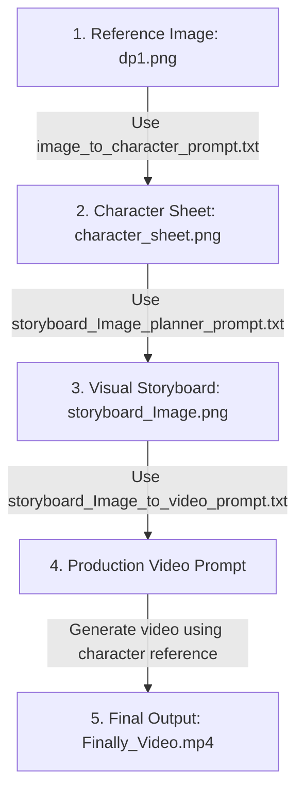

# AI Video Creation Prompts & Character Consistency Suite 🎬

This repository contains system prompt templates and reference assets to generate consistent virtual AI model/influencer images and video reels. 

It includes a complete step-by-step pipeline demonstrating how a single reference image is processed through storyboards into a final high-quality video.

---

## 📂 Repository Contents

### 1. 🖼️ Visual Workflow Assets
* **`dp1.png`**: The primary reference face image defining the visual identity of the AI model.
* **`character_sheet.png`**: A multi-pose and multi-angle character reference sheet generated from `dp1.png` to maintain facial consistency in different scenes.
* **`storyboard_Image.png`**: A 3x2 grid storyboard layout detailing 6 cinematic scenes, actions, and camera framings for a 10-second reel concept.
* **`Finally_Video.mp4`**: The final photorealistic, lip-synced video reel generated based on the storyboard and final video prompt.

### 2. 📝 AI System Prompts (Templates)
* **[ai_influencer_prompt.txt](file:///Users/akashyadav/Server/Go-Map/N8N-Agent/ai_video_creation/ai_influencer_prompt.txt)**: Instructions to generate consistent virtual influencer videos using reference images.
* **[image_to_character_prompt.txt](file:///Users/akashyadav/Server/Go-Map/N8N-Agent/ai_video_creation/image_to_character_prompt.txt)**: Analyzes the reference face (`dp1.png`) and outputs a structured prompt to generate a character sheet (`character_sheet.png`).
* **[storyboard_Image_planner_prompt.txt](file:///Users/akashyadav/Server/Go-Map/N8N-Agent/ai_video_creation/storyboard_Image_planner_prompt.txt)**: Takes a character sheet and reel ideas/song lyrics to outline a structured storyboard concept.
* **[storyboard_Image_to_video_prompt.txt](file:///Users/akashyadav/Server/Go-Map/N8N-Agent/ai_video_creation/storyboard_Image_to_video_prompt.txt)**: Converts the storyboard layout (`storyboard_Image.png`) into a highly detailed, production-ready video generation prompt (including Lip-sync, Physics Lock, and Camera Style sections) to produce the final output (`Finally_Video.mp4`).

---

## ⚡ Step-by-Step Generation Pipeline

This flowchart shows how the files in this directory are utilized in sequence to create the final video:

---

## 🛠️ Usage Instructions

1. **Lock the Face**: Upload `dp1.png` and run the prompt in `image_to_character_prompt.txt` to generate your multi-angle `character_sheet.png`.
2. **Plan the Concept**: Use `storyboard_Image_planner_prompt.txt` with your character sheet and lyrics/ideas to plan your storyboard structure.
3. **Generate the Storyboard**: Convert that structure into a visual grid `storyboard_Image.png`.
4. **Build the Video Prompt**: Input `storyboard_Image.png` into the `storyboard_Image_to_video_prompt.txt` system prompt to get the final detailed generation prompt.
5. **Generate Final Video**: Run the output prompt in your AI Video Generator (like Kling, Runway, or Luma) along with the character reference to get `Finally_Video.mp4`.
