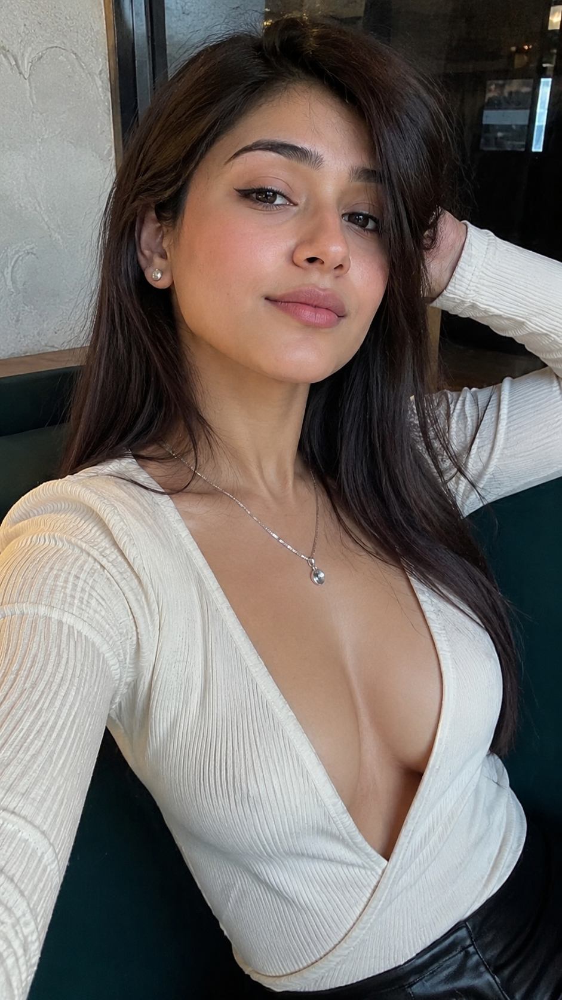
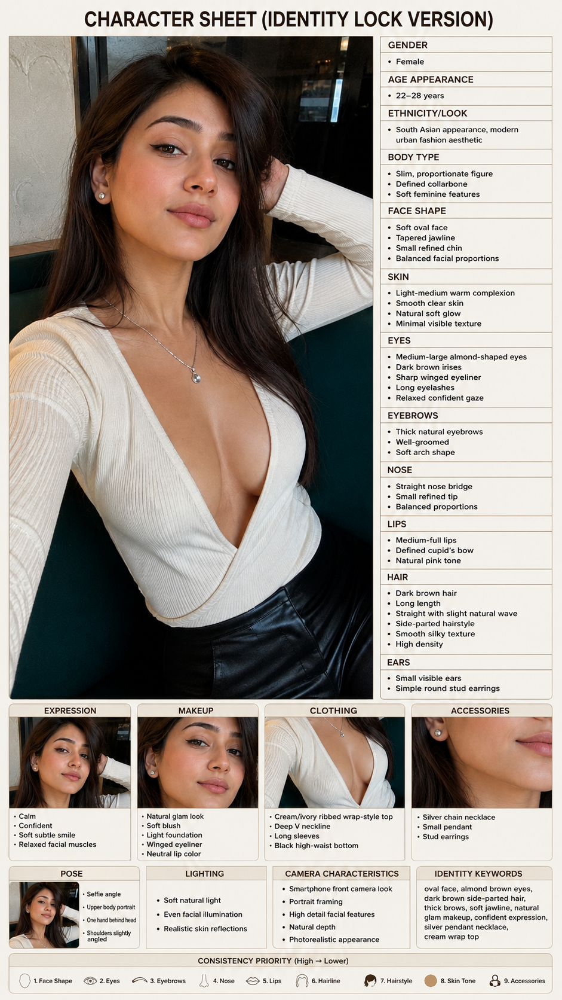
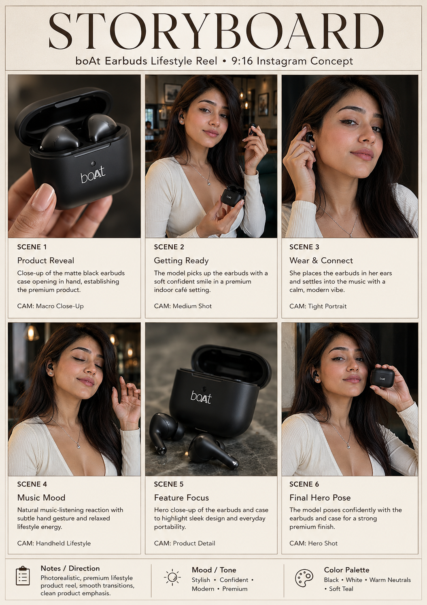

<](LICENSE)
[](#)
[](#)
[](https://github.com/kodelyx/ai-video-creation/stargazers)

---

**One reference image → Character Sheet → Storyboard → Production-Ready Video**

*Fully prompt-driven. No coding required. Works with Kling, Runway, Luma, Veo & more.*

</div>

---

## 🔥 Live Demo — From Photo to Final Reel

> Below is the **actual output** of this pipeline — from a single selfie to a photorealistic product reel.

### Step 1 → Reference Image (`dp1.png`)
*The single source-of-truth for the AI model's identity.*

<p align="center">
  
</p>

---

### Step 2 → Character Sheet (`character_sheet.png`)
*AI-generated identity lock sheet — face shape, eyes, skin, hair, expression, accessories, and a consistency priority strip at the bottom.*

<p align="center">
  
</p>

---

### Step 3 → Storyboard (`storyboard_Image.png`)
*A 6-panel cinematic storyboard with scene titles, camera styles, and direction notes — ready for video prompt generation.*

<p align="center">
  
</p>

---

### Step 4 → Final Video Output (`Finally_Video.mp4`)
*The production-ready 9:16 Instagram reel generated from the storyboard and character reference.*

<p align="center">
  <a href="Finally_Video.mp4">
    
  </a>
</p>

> 💡 **GitHub doesn't stream `.mp4` inline.** Click the badge above or [download `Finally_Video.mp4`](Finally_Video.mp4) to watch.

---

## ⚡ How the Pipeline Works

```mermaid
graph LR
    A["📸 Reference Photo<br/>(dp1.png)"] -->|"image_to_character_prompt.txt"| B["🎭 Character Sheet<br/>(character_sheet.png)"]
    B -->|"storyboard_Image_planner_prompt.txt"| C["🎬 Storyboard<br/>(storyboard_Image.png)"]
    C -->|"storyboard_Image_to_video_prompt.txt"| D["📝 Video Prompt"]
    D -->|"AI Video Generator"| E["🎥 Final Reel<br/>(Finally_Video.mp4)"]

    style A fill:#1a1a2e,stroke:#e94560,color:#fff
    style B fill:#1a1a2e,stroke:#0f3460,color:#fff
    style C fill:#1a1a2e,stroke:#533483,color:#fff
    style D fill:#1a1a2e,stroke:#e94560,color:#fff
    style E fill:#16213e,stroke:#0f3460,color:#fff
```



| Step | Input | Prompt File | Output |
|:----:|:------|:------------|:-------|
| **1** | Your photo | [`image_to_character_prompt.txt`](image_to_character_prompt.txt) | `character_sheet.png` |
| **2** | Character sheet + Reel idea | [`storyboard_Image_planner_prompt.txt`](storyboard_Image_planner_prompt.txt) | `storyboard_Image.png` |
| **3** | Storyboard image | [`storyboard_Image_to_video_prompt.txt`](storyboard_Image_to_video_prompt.txt) | Production video prompt |
| **4** | Video prompt + Character ref | *Your AI video tool* | `Finally_Video.mp4` |

---

## 📂 Repository Structure

```
ai-video-creation/
│
├── 🖼️  dp1.png                               # Source identity photo
├── 🎭  character_sheet.png                     # AI-generated identity lock sheet
├── 🎬  storyboard_Image.png                    # 6-panel cinematic storyboard
├── 🎥  Finally_Video.mp4                       # Final output — 9:16 reel
│
├── 📝  image_to_character_prompt.txt           # Step 1 — Photo → Character Sheet
├── 📝  storyboard_Image_planner_prompt.txt     # Step 2 — Sheet → Storyboard
├── 📝  storyboard_Image_to_video_prompt.txt    # Step 3 — Storyboard → Video Prompt
├── 📝  ai_influencer_prompt.txt                # Bonus — Direct video generation prompt
│
└── 📄  README.md
```

---

## 🚀 Step-by-Step Usage Guide

### Step 1 — Lock the Face Identity

Upload your reference photo (`dp1.png`) to any image-generation AI (Gemini, ChatGPT, Midjourney, etc.) along with the prompt from:

📄 **[`image_to_character_prompt.txt`](image_to_character_prompt.txt)**

This prompt instructs the AI to:
- Analyze facial features (face shape, eyes, nose, lips, skin tone, hair)
- Generate a professional **Character Sheet** with identity lock
- Include a **consistency priority strip** for future generations

**Output** → `character_sheet.png`

---

### Step 2 — Plan the Storyboard

Upload the `character_sheet.png` along with your reel concept (song lyrics, product idea, or theme) using:

📄 **[`storyboard_Image_planner_prompt.txt`](storyboard_Image_planner_prompt.txt)**

This prompt will:
- Analyze the character identity & vibe
- Auto-suggest a reel concept (lifestyle / product / attitude / cultural)
- Ask for your approval before generating
- Create a **6-panel 3×2 storyboard** with scene titles, descriptions, and camera styles

**Output** → `storyboard_Image.png`

---

### Step 3 — Generate the Video Prompt

Upload the `storyboard_Image.png` and use:

📄 **[`storyboard_Image_to_video_prompt.txt`](storyboard_Image_to_video_prompt.txt)**

This is the most detailed prompt — it converts the storyboard into a **production-ready video generation prompt** with:
- Scene-by-scene timestamps (0.0–1.5s, 1.5–3.0s, etc.)
- Camera styles per scene (macro, portrait, handheld, hero shot)
- Physics lock rules (no floating objects, correct hand anatomy)
- Hindi dialogue with lip-sync instructions
- Negative prompt rules (no cartoon, no distortion, no watermarks)

**Output** → A complete prompt ready to paste into your AI video generator

---

### Step 4 — Generate the Final Video

Paste the generated video prompt into your preferred AI video tool:

| Tool | Best For |
|:-----|:---------|
| **Kling AI** | Lip-sync + character consistency |
| **Runway Gen-3** | Cinematic motion quality |
| **Luma Dream Machine** | Fast iterations |
| **Google Veo** | Photorealism |
| **Pika Labs** | Quick stylized reels |

Upload the `character_sheet.png` as the identity reference alongside the prompt.

**Output** → `Finally_Video.mp4` 🎉

---

## 🎯 Bonus: Direct Video Prompt

For quick one-shot videos without the full pipeline, use:

📄 **[`ai_influencer_prompt.txt`](ai_influencer_prompt.txt)**

This is a standalone prompt that:
- Locks the character identity from the reference image
- Generates a lip-synced Hindi dialogue video
- Just swap the `Hindi Dialogue` section for each new video

---

## 💡 Pro Tips

- **Identity consistency** is the #1 priority — always use the character sheet as reference
- **Hindi dialogue** should be natural and short (under 10 seconds for reels)
- **Physics Lock** section prevents common AI artifacts like floating objects and extra fingers
- **Negative prompts** are crucial — they block cartoon, 3D, anime, and distorted outputs
- Works best with **9:16 vertical format** for Instagram/YouTube Shorts/TikTok

---

## 🤝 Contributing

Found a better prompt technique? Have improvements? PRs are welcome!

1. Fork the repo
2. Create your branch (`git checkout -b improve-prompt`)
3. Commit changes (`git commit -m 'improve: better physics lock rules'`)
4. Push (`git push origin improve-prompt`)
5. Open a Pull Request

---

## ⭐ Star This Repo

If this pipeline saved you hours of prompt engineering, **give it a star** ⭐ — it helps others discover it!

---

<div align="center">

**Built with 🧠 AI Prompt Engineering | No Code Required**

*From a single selfie to a cinematic Instagram reel — fully automated with AI.*

</div>
]]>
